| Disciplina:  Sistemas Operacionais | Profa. Alana Oliveira |
|:--------------------|:------------:|
| Nome do(a) aluno(a):               | Israel Barbosa Silva  |
| Data:                              | 05/07/2025            |

#### Descrição do Ambiente Utilizado

- **Tipo de ambiente:**  
Para a realização desta atividade foi utilizado um ambiente Linux, por meio do WSL (Windows Subsystem for Linux) no Windows 11.

- **Distribuição Linux utilizada:**  
A distribuição Linux utilizada foi o Ubuntu 22.04 LTS.

- **Outros detalhes relevantes:**  
A atividade foi realizada no PowerShell do Windows, utilizando o WSL para acessar o ambiente Linux  
O Visual Studio Code em conjunto com o Jupyter utilizando o formato Markdown foi utilizado para a criação deste relatório.

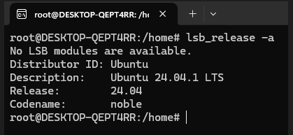

#### Etapas da Atividade

Criando os usuários com o comando `sudo useradd -m -s /bin/bash` e verificando se foram criados usando o comando `id <nome_usuario>` para cada um deles:

Monica
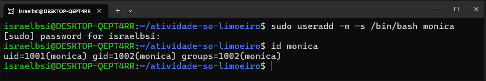

Cebolinha
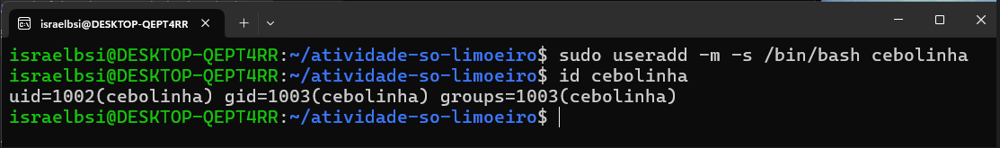

Cascão
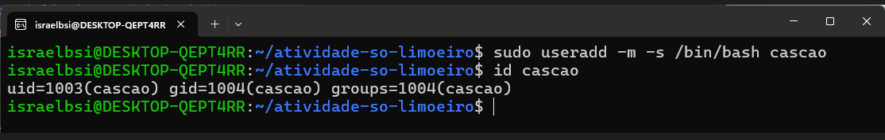

Magali
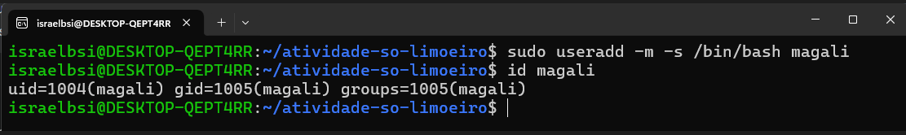

- Para criação dos arquivos foi usado o comando `touch <caminho do arquivo>` e para verificar se foram criados, usamos o comando `ls`:
- Ocorreu um erro ao tentar criar o arquivo da monica, isso por que eu não estava com o usuario root, então foi necessário usar o comando `sudo bash` para acessar o usuário root e criar o arquivo.

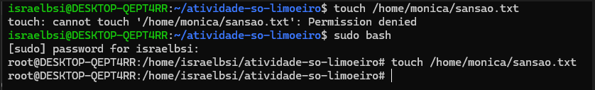

- Após isso foi possível criar os arquivos de cada usuário, e para verificar se foram criados, usamos o comando `ls <diretorio> -l`: 

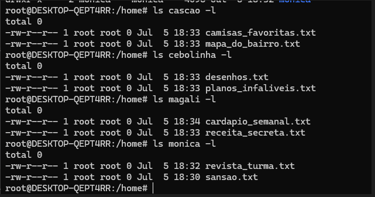

- Para criar os grupos e atribuir os usuarios e os arquivos a eles, foi utilizado o comando `sudo chown <usuario>:<grupo> <arquivo>` e para verificar se foram criados, usamos o comando `ls -l`:

Monica:
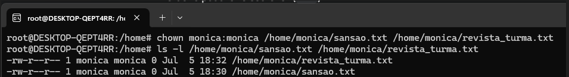

Cebolinha:
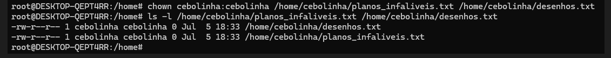

Cascão:
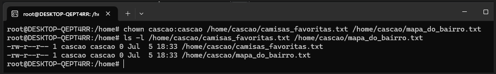

Magali:
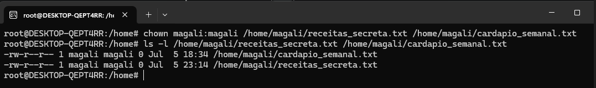

- Para Habilitar permissão somente de dono foi utilizado o comando `chmod 600 <arquivo>`
- Esse comando garante que apenas o dono do arquivo tenha permissão de leitura e escrita, enquanto os outros usuários não têm acesso ao arquivo.

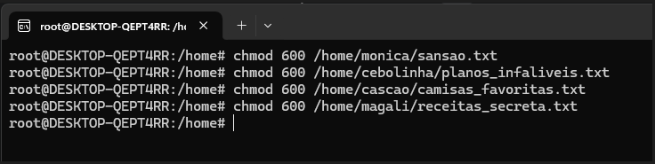

- Para habilitar a permissão de leitura para todos e escrita apenas para o dono, foi utilizado o comando `chmod 644 <arquivo>`.

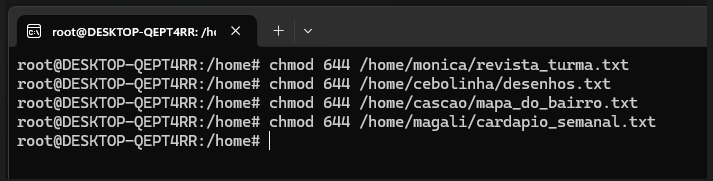

- Para testar as permissões, foi utilizado o comando `sudo -u <usuario> cat <arquivo>` para cada usuário, verificando se cada um tinha acesso ao arquivo de acordo com as permissões definidas.
- O comando `sudo -u <usuario> cat <arquivo>` permite que você execute o comando `cat` como um usuário específico, verificando se ele tem permissão para ler o arquivo.

- Ao tentar acessar o arquivo da Magali, o usuário Cebolinha não conseguiu ler o arquivo, pois ele não tinha permissão de leitura.

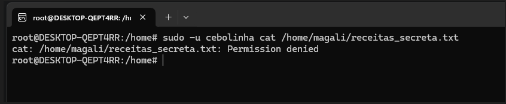

- Mesmo configurando o arquivo da Magali para que o Cebolinha pudesse ler, ele não conseguiu acessar o arquivo, pois o usuário Cebolinha não tinha permissão de leitura na pasta.
- Para resolver isso, foi necessário alterar as permissões da pasta onde o arquivo estava localizado, permitindo que o usuário Cebolinha pudesse acessar a pasta.
- Para isso, foi utilizado o comando `sudo chmod o+x <diretorio>`.

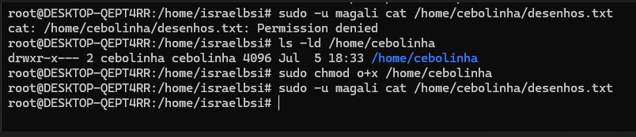