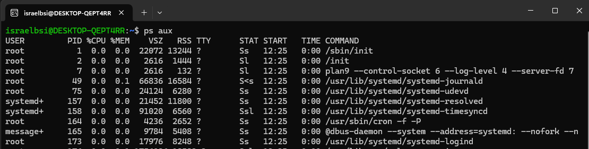
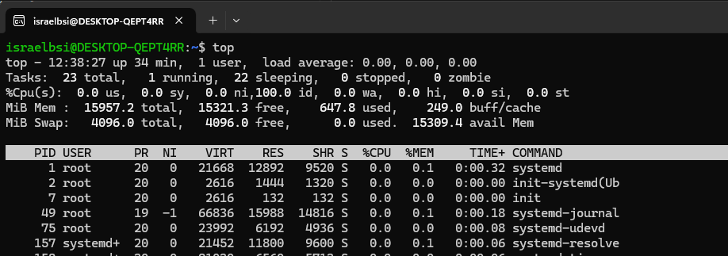
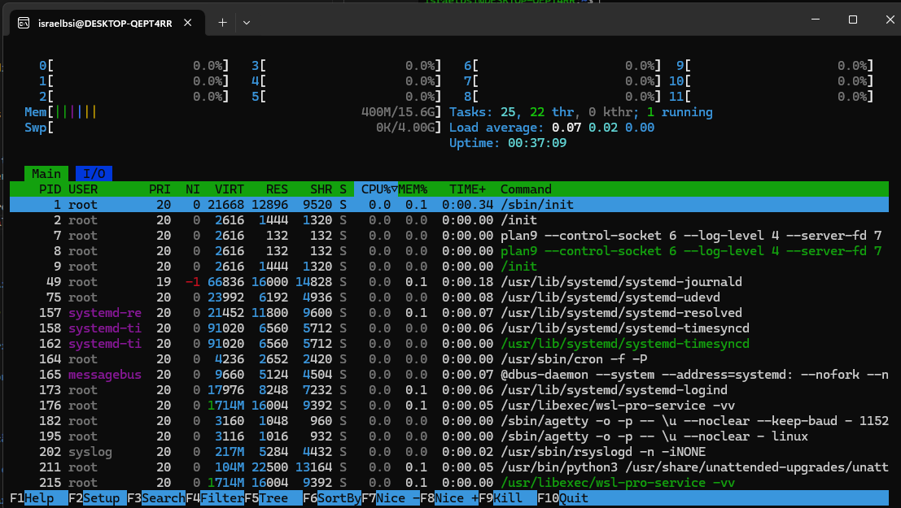
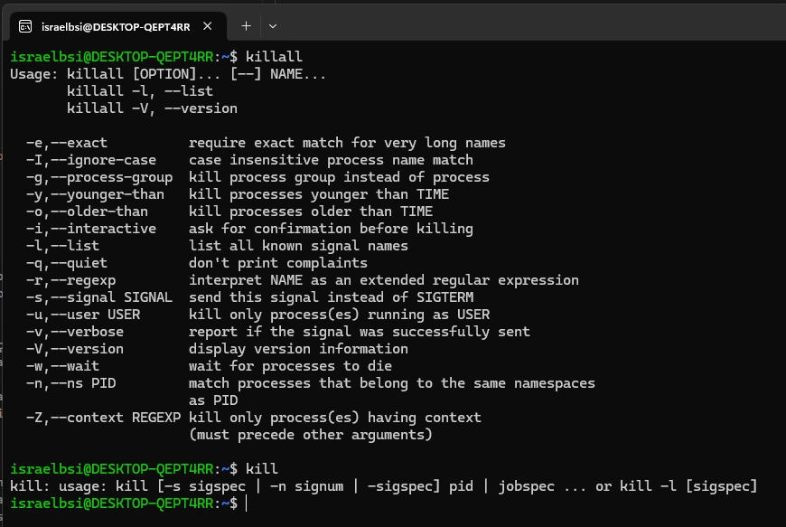
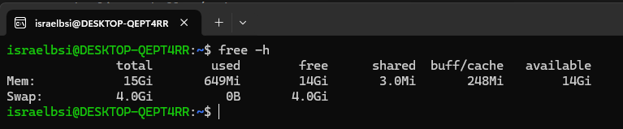
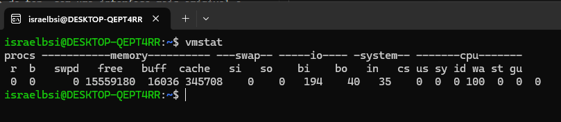

| Disciplina:  Sistemas Operacionais | Profa. Alana Oliveira |
|:-----------------------------------|:----------------------|
| Nome do aluno:                     | Israel Barbosa Silva  |
| Nome do aluno:                     | Israel Barbosa Silva  |
| Nome do aluno:                     | Israel Barbosa Silva  |
| Sistema Operacional escolhido:     | Ubuntu 22.04          |
| Data:                              | 06/07/2025            |

## 1 Gerência de Processos

### Como o sistema cria e gerencia processos?

O Ubuntu adota um modelo clássico de criação de processos usando as chamadas de sistema fork() e exec(). A função fork() gera uma cópia quase exata do processo pai, resultando em um processo filho com um novo PID, enquanto exec() substitui o espaço de memória do filho com um novo programa, mantendo o mesmo PID. 

Por exemplo, quando você digita ls no terminal, o shell (como o bash) utiliza fork() para criar um processo filho que, em seguida, executa exec() para carregar e executar o comando ls, com o pai aguardando a finalização do filho.  

Internamente, o Kernel gerencia cada processo através da estrutura task_struct, que contém informações essenciais como estado, memória e arquivos abertos. O escalonador, como o Completely Fair Scheduler (CFS), distribui o tempo de CPU entre os processos, garantindo uma execução equilibrada e eficiente.

### Há suporte a threads, multitarefa ou paralelismo?

O Ubuntu oferece suporte robusto para multitarefa preemptiva, permitindo que o kernel interrompa processos em execução para evitar que um único processo monopolize a CPU. Isso assegura que múltiplos processos possam ser executados "ao mesmo tempo", mantendo o sistema responsivo.

Além disso, o sistema possui um forte suporte a threads, que são tratadas como processos leves (LWPs) e compartilham recursos como memória e descritores de arquivo. A biblioteca padrão para criação de threads é a pthreads, facilitando a comunicação rápida e eficiente entre elas.

O hardware moderno com múltiplos núcleos possibilita o paralelismo verdadeiro, já que o kernel pode agendar diferentes processos ou threads para serem executados simultaneamente, ampliando o poder de processamento e a capacidade de resposta do sistema.

### Como o usuário ou o administrador pode visualizar, controlar ou encerrar processos?

#### ps
- **Descrição**: Exibe uma lista de processos em execução no sistema, permitindo visualizar informações como PID, uso de CPU e memória.
- **Comando**: `ps aux`
- **Informações Exibidas**:
    - USER: Usuário que executa o processo
    - PID: Identificador do processo
    - %CPU: Percentual de uso da CPU
    - %MEM: Percentual de uso da memória
    - COMMAND: Comando que iniciou o processo    
    - VSZ: Tamanho virtual do processo
    - RSS: Tamanho residente na memória física
    - STAT: Estado do processo
    - START: Hora de início do processo
    - TIME: Tempo total de CPU usado pelo processo
    - TTY: Terminal associado ao processo

     
    
#### top
- **Descrição**: Exibe em tempo real os processos ativos, uso de CPU e memória, permitindo identificar quais processos estão consumindo mais recursos.
- **Comando**:  `top`
    
- **Informações Exibidas**:
    - Lista de processos atualizada dinamicamente
    - Uso detalhado de CPU
    - Uso de memória
    - Tempo de execução dos processos

    

#### htop
- **Descrição**: Uma versão aprimorada do top, com uma interface mais amigável e recursos adicionais.
- **Comando**: `htop`
- **Recursos Adicionais**:
    - Permite ordenar processos por diferentes critérios (CPU, memória, etc.).
    - Possibilita o encerramento de processos diretamente pela interface.

    

#### gnome-system-monitor
- **Descrição**: Uma ferramenta gráfica para monitoramento de sistema que exibe informações sobre processos, uso de CPU, memória e rede.
- **Comando**: `gnome-system-monitor`

    

#### kill, killall, pkill
- **Descrição**: Comandos para enviar sinais a processos, permitindo encerrá-los ou alterar seu comportamento.
- **Comando**: `kill <PID>`, `killall <nome_do_processo>`, `pkill <nome_do_processo>`

    

## 2 Gerência de Memória

### O sistema usa memória virtual?

Sim, a memória virtual simula um espaço contíguo e extenso para cada processo, independentemente da quantidade física instalada. Isso permite que cada aplicação opere como se tivesse acesso a uma grande capacidade de memória, garantindo vantagens como o isolamento entre processos e a otimização do uso da RAM.

- **Isolamento de Processos**: Cada processo possui seu próprio espaço de endereçamento virtual, impedindo acesso não autorizado entre processos e aumentando a segurança e estabilidade do sistema.

- **Eficiência no Uso da RAM**: O sistema carrega na memória apenas as partes do programa que estão em uso, utilizando a área de swap para armazenar dados não ativos, otimizando o consumo de memória.

### Há paginação ou segmentação?

- No Linux moderno, a segmentação é mínima devido ao modelo flat, sendo a paginação o principal mecanismo de gerenciamento de memória. A memória é dividida em páginas de tamanho fixo (geralmente 4 KiB), e o sistema utiliza tabelas de páginas para mapear os endereços virtuais para os físicos. O carregamento sob demanda permite que as páginas sejam trazidas do disco para a RAM apenas quando necessário, otimizando o desempenho e o uso dos recursos.

### Como ocorre o gerenciamento entre processos ativos e memória disponível?

- O Kernel Linux gerencia a memória atribuída aos processos por meio de mecanismos que alocam, liberam e realocam recursos conforme a demanda. Inicialmente, ele reserva as estruturas necessárias, como tabelas de páginas, e, à medida que os processos requisitam mais memória, novas páginas são mapeadas. Quando a memória RAM esgota, o sistema utiliza o swap, transferindo páginas inativas para o disco, embora com uma queda de desempenho devido à maior latência de acesso.

- Além disso, o Linux agiliza o acesso a dados com o cache de página, que armazena arquivos lidos para acelerar futuras operações, e incorpora o OOM Killer, um mecanismo de emergência que encerra processos para liberar memória quando os recursos estão completamente esgotados.

### Há ferramentas para monitoramento (ex: top, free, etc.)?

Sim, o Ubuntu 22.04 oferece várias ferramentas para monitoramento de memória e processos:

#### free
- **Descrição**: Exibe uma visão geral do uso de memória no sistema.
- **Comando**:  `free -h`

#### Informações Exibidas
- **total**: Total de RAM física.
- **used**: Memória usada por processos.
- **free**: Memória efetivamente não utilizada.
- **shared**: Memória compartilhada entre processos.
- **buff/cache**: Memória usada para cache de disco e buffers. Essa memória pode ser liberada se necessário.
- **available**: Estimativa da memória disponível para novos aplicativos sem recorrer ao swap.
- **Swap**: Exibe o total, o usado e o livre do espaço de troca.

    

#### vmstat
- **Descrição**: Exibe estatísticas sobre processos, memória, paginação, blocos de E/S e CPU, permitindo uma análise mais detalhada do desempenho do sistema.
- **Comando**: `vmstat`

    

#### top, htop, gnome-system-monitor
- Estas ferramentas já foram discutidas na seção de Gerência de Processos, mas também fornecem informações sobre o uso de memória pelos processos em execução.

## 3 Gerência de Arquivos

### Qual é o sistema de arquivos utilizado (ex: NTFS, ext4, Btrfs...)?

### Como os arquivos são organizados?

### Há suporte a permissões por usuário/grupo?

### Quais operações básicas são disponíveis?

## 4 Proteção e Segurança

### Como o sistema trata a autenticação de usuários?

### Há mecanismos de criptografia ou controle de acesso?

### Existe separação clara entre usuários comuns e administradores?

### Há antivírus, firewall, SELinux, AppArmor, UAC etc.?

## Comparativo com o que foi estudado
- 

## Fontes

#### Documentação
- [Documentação do Kernel Linux Sobre Gerenciamento de Memória](https://www.kernel.org/doc/html/latest/admin-guide/mm/index.html)

- [Documentação do Kernel Linux sobre Scheduler](https://www.kernel.org/doc/html/latest/scheduler/index.html)

- Manual do Comando `man free`: [free(1) — Linux manual pages](https://man7.org/linux/man-pages/man1/free.1.html)

- Manual do Comando `man top`: [top(1) — Linux manual pages](https://man7.org/linux/man-pages/man1/top.1.html)

- Manual do Comando `man htop`: [htop(1) — Linux manual pages](https://man7.org/linux/man-pages/man1/htop.1.html)

- Manual do Comando `man vmstat`: [vmstat(8) — Linux manual pages](https://man7.org/linux/man-pages/man8/vmstat.8.html)

- Manual do Comando `man gnome-system-monitor`: [Monitor do Sistema](https://apps.gnome.org/pt-BR/SystemMonitor/)

- Manual do Comando `man 2 fork`: [fork(2) — Linux manual pages](https://man7.org/linux/man-pages/man2/fork.2.html)

- Manual do Comando `man 3 exec`: [exec(3) — Linux manual pages](https://man7.org/linux/man-pages/man3/exec.3.html)

- [Artigo sobre o OOM Killer](https://www.oracle.com/br/technical-resources/articles/it-infrastructure/dev-oom-killer.html)

- [Artigo sobre a implementação de Threads no Linux](https://man7.org/linux/man-pages/man7/pthreads.7.html)

#### Livros

- Love, Robert. Linux Kernel Development, 3rd Edition. Addison-Wesley Professional, 2010. 

- Bovet, Daniel P., e Cesati, Marco. Understanding the Linux Kernel, 3rd Edition. O'Reilly Media, 2005